# CRUD  Java

---

# Programação Orientada a Objetos

## Desenvolvimento de um CRUD com Java, IntelliJ IDEA, Maven e PostgreSQL

### author: rogerio-silva date: 21/03/2024
### updated: 31/07/2024
---

# Sumário

1. [Configuração do ambiente de desenvolvimento (PostgreSQL e pgAdmin4)](#configuração-do-ambiente-de-desenvolvimento)
2. [Configurando o Database server no pgAdmin](#configurando-o-database-server-no-pgadmin)
2. [Configuração do ambiente de desenvolvimento (Maven)](#configuração-do-ambiente-de-desenvolvimento-maven)
3. [Desenvolvimento do código](#desenvolvimento-do-código)
4. [Testando o CRUD](#testando-o-crud)
5. [Considerações finais](#considerações-finais)

---

# Configuração do ambiente de desenvolvimento

## Instalação do PostgreSQL no Ubuntu

Fonte: [Adaptado de (DioLinux, 2021)](https://www.dio.me/articles/instale-o-postgresql-com-pgadmin4-no-ubuntu-2004)

Crie a configuração do repositório de arquivos:

```shell
sudo sh -c 'echo "deb http://apt.postgresql.org/pub/repos/apt $ (lsb_release -cs) -pgdg main"> /etc/apt/sources.list.d/pgdg.list' 
```

Importe a chave de assinatura do repositório:

```shell
wget --quiet -O - https://www.postgresql.org/media/keys/ACCC4CF8.asc | sudo apt-key add -
```

Atualize as listas de pacotes:

```shell
sudo apt-get update
```

Instale a versão mais recente do PostgreSQL.
Se você quiser uma versão específica, use 'postgresql-12' ou semelhante em vez de 'postgresql':

```shell 
sudo apt-get -y install postgresql
```

### Configuração do PostgreSQL

Depois de instalar o PostgreSQL, os comandos abaixo podem ser usados ​​para parar, iniciar, habilitar e verificar seu
status

```
sudo systemctl stop postgresql.service 
sudo systemctl start postgresql.service
sudo systemctl enable postgresql.service
sudo systemctl status postgresql.service 
```

Depois de instalado seu SGBD postgres, como criar seu 1° usuário?
Primeiro entre com seu super usuário

```shell
 sudo su 
 ```

Entre no banco postgres.

```shell
su postgres
```

Depois entre com o comando:

```shell
psql
```

### Configuração de usuário e senha PostgreSQL Linux

Criar usuário no PostgreSQL

```postgresql
CREATE USER nome_do_usuario SUPERUSER INHERIT CREATEDB CREATEROLE;
```

Alterar senha do usuário no PostgreSQL

```postgresql
ALTER USER nome_do_usuario PASSWORD 'senha';
```

## Instalação do pgAdmin4

Instale a chave pública para o repositório:

```shell
sudo curl https://www.pgadmin.org/static/packages_pgadmin_org.pub | sudo apt-key add
```

Crie o arquivo de configuração do repositório:

```shell
sudo sh -c 'echo "deb https://ftp.postgresql.org/pub/pgadmin/pgadmin4/apt/$(lsb_release -cs) pgadmin4 main"> /etc/apt/sources.list.d/pgadmin4.list && apt update '
```

Instale para os modos desktop e web:

```shell
sudo apt install pgadmin4
```

---

# Configurando o *database Server* no pgAdmin

- Abra o pgAdmin4
- Clique com o botão direito do mouse em *Servers* e selecione *Create* > *Server...* ou clique em *Add New Server* na
  janela **Welcome** da aba *Dashboard*

  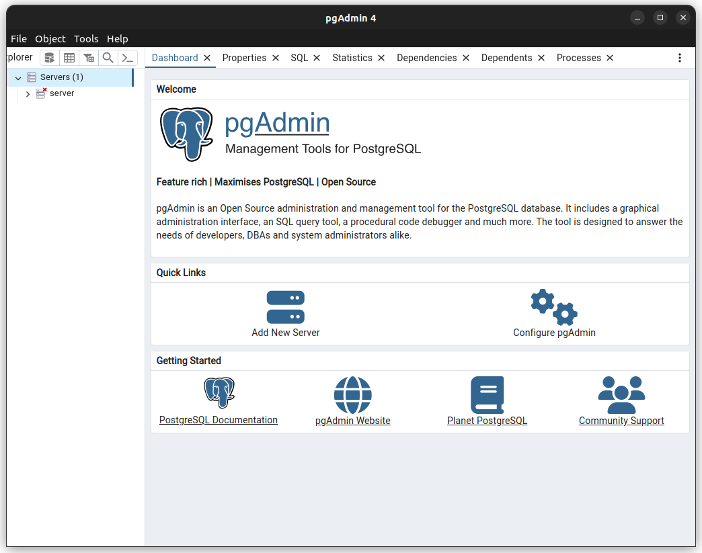


- Na guia *General*, insira um nome no campo *Name* para o servidor.

  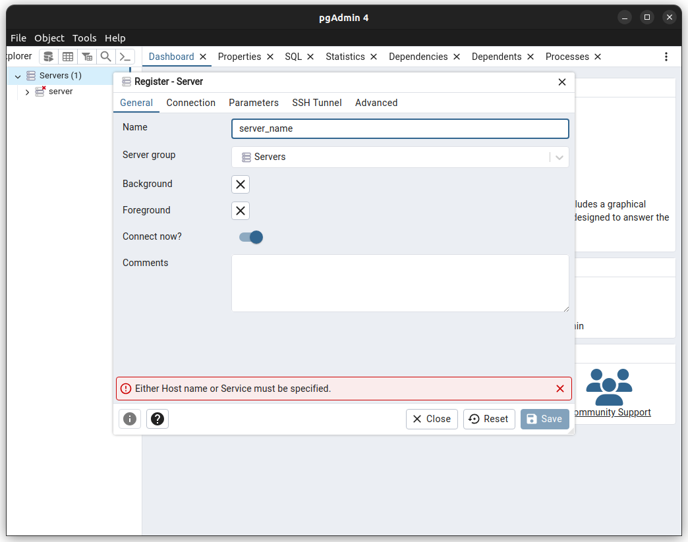


- Na guia *Connection*, insira as informações do servidor PostgreSQL. Insira o endereço do servidor em *Host
  name/address*, o número da porta em *Port* (mantenha a sugestão padrão: 5432), o nome do usuário em *Username* e a
  senha em *Password*. Clique em *Save*

  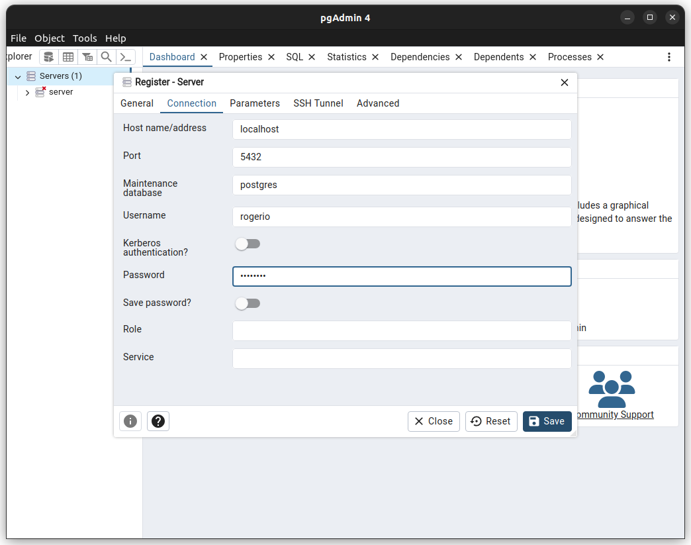

- Clique com o botão direito do mouse no servidor criado e selecione *Connect*. Insira a senha do usuário do PostgreSQL,
  caso seja solicitada. Clique em *OK*. O servidor PostgreSQL estará conectado

  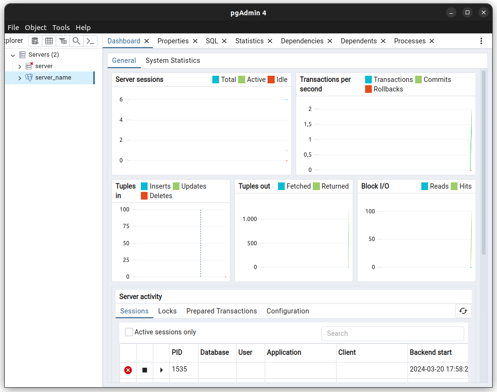

- Clique com o botão direito do mouse em *Databases* e selecione *Create* > *Database...*

  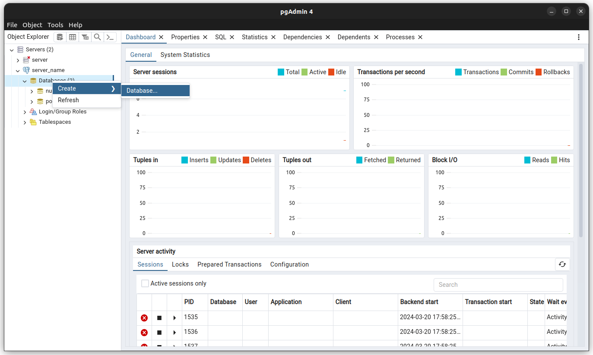

- Na guia *General*, insira um nome para o banco de dados. Clique em *Save*. O banco de dados estará criado.

  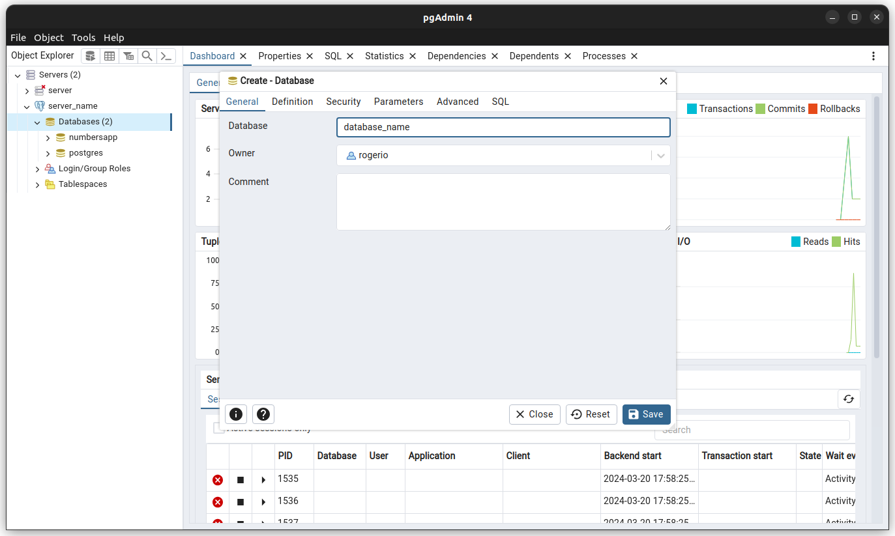

- Clique com o botão direito do mouse no banco de dados criado e selecione *Query Tool*
  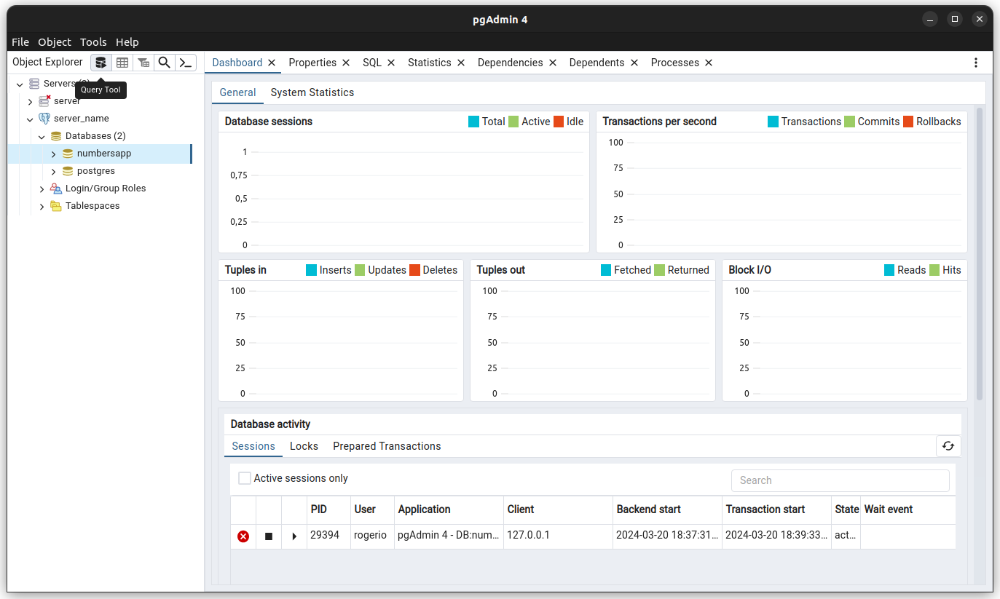

- Insira o comando SQL. Clique em *Execute script* (F5) para executar o comando.

  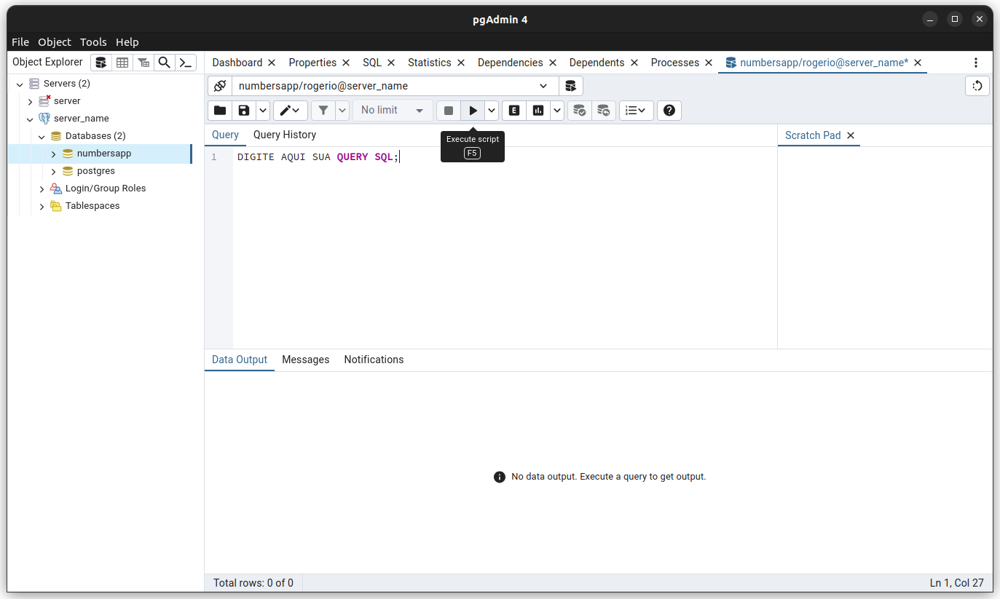

# Configuração do ambiente de desenvolvimento (Maven)

## Configuração do ambiente no IntelliJ IDEA

- Inicie o IntelliJ IDEA e clique em *Create New Project* (botão na parte superior da tela)

  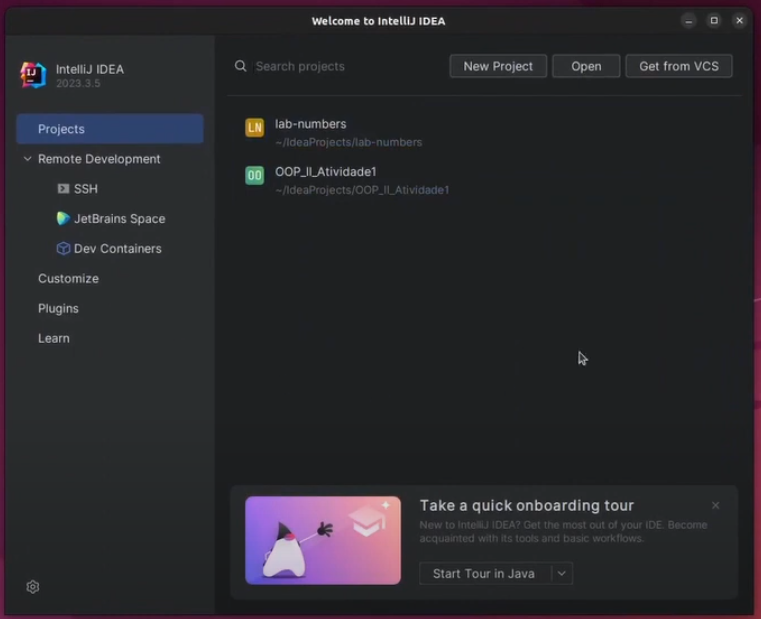

- Criação de um novo projeto Maven.

  + Selecione a opção *Maven Archetype* na caixa de seleção *Generators*
  + Preencha o campo *Name* com o nome do projeto
  + Selecione a localização do projeto em *Location*
  + Marque a opção para criação do repositório GIT em *Create GIT repository*
  + Selecione a versão do JDK Java em *JDK* 

  + 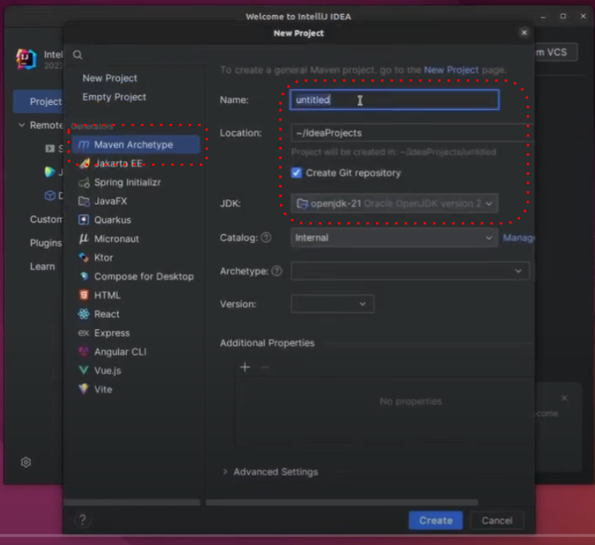

  + Selecione o arquétipo na opção *Archetype* (no exemplo, foi selecionado *maven-archetype-webapp*)
  
  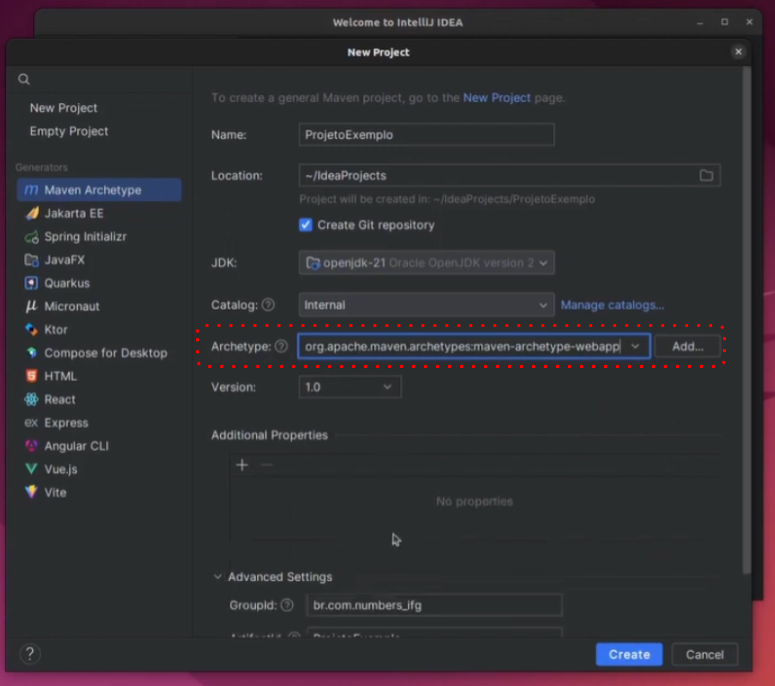

  + Todo projeto Maven possui três campos que constituem a identificação do projeto.
Esse conjunto deve ser único para cada projeto e a partir dele é que um projeto Maven é identificado. São eles:

    + **groupId**: o ID do grupo que desenvolveu o projeto. Por convenção, o valor desse campo é o domínio da instituição invertido. Exemplos: com.andgomes, br.com.suaempresa.

    + **artifactId**: o ID do projeto. Exemplos: simple-project, my-java-project.

    + **version**: a versão atual do projeto. Exemplos: 1.0-SNAPSHOT(significa “versão 1.0 em desenvolvimento”), 2.4.2.
  + Preencha os campos *Group Id*, *Artifact Id* e *Version* com os valores desejados.
  
  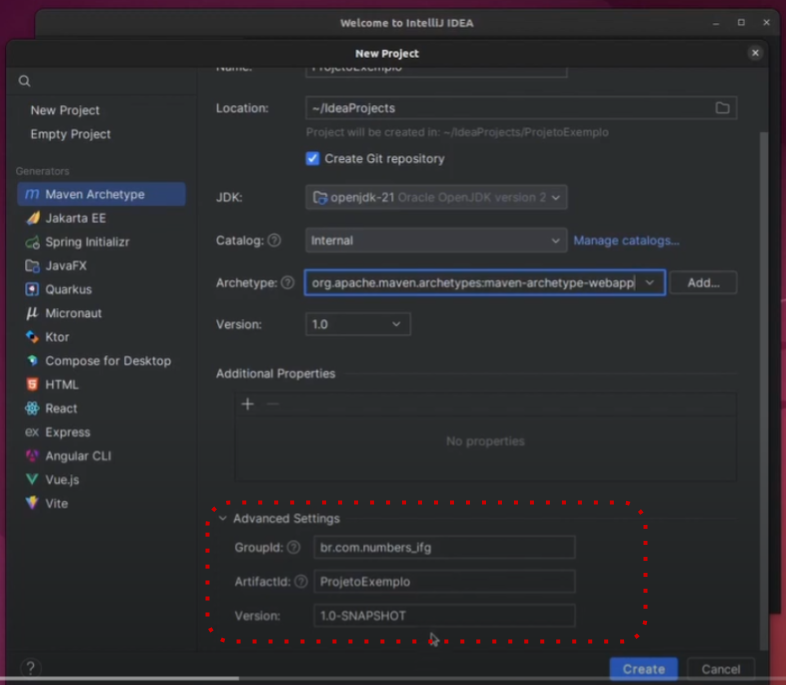
  + Clique em *Create* para criar o projeto.  
---

## Desenvolvimento do código

- Estrutura básica de um projeto Java (sugestão de organização)

  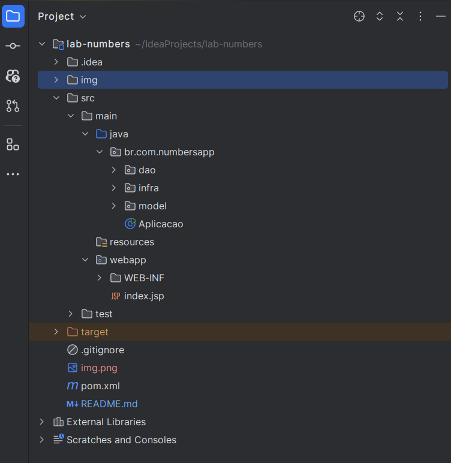

  A estrutura do projeto é composta por:
  +  **lab_numbers** é a pasta raiz do projeto
  + **.idea** é uma pasta oculta que contém as configurações do projeto relativas à IDE IntelliJ IDEA
  + **src** é a pasta que contém o código-fonte do projeto
    + **main** é a pasta que contém o código-fonte principal do projeto
    + **java** é a pasta que contém os arquivos Java do projeto
      + Observe que dentro da pasta **java** há um pacote chamado 
      **br.com.numbersapp** que contém as classes do projeto, organizadas como: 
        + **dao** (data access objects), contendo as classes de acesso aos dados, 
        + **infra** contém as classes que operam na infraestrutura do projeto, e 
        + **model** que contém as classes de modelo do projeto, por exemplo, a classe **Pessoa** que define as características de uma pessoa na perspectiva do projeto.
  + **test** é a pasta que contém o código-fonte de teste do projeto
  + **target** é a pasta que contém os arquivos compilados do projeto
  Na raiz do projeto há o arquivo **pom.xml** que contém as configurações do projeto Maven.

- Criação das classes principais do CRUD
- Implementação dos métodos para criar, ler, atualizar e deletar registros no PostgreSQL

## Criação da classe de conexão com o banco de dados

```java


---


## Testando o CRUD

- Demonstração de testes com interface gráfica ou API REST

---

## Considerações finais

- Recapitulação dos pontos principais
- Recursos adicionais para aprofundamento